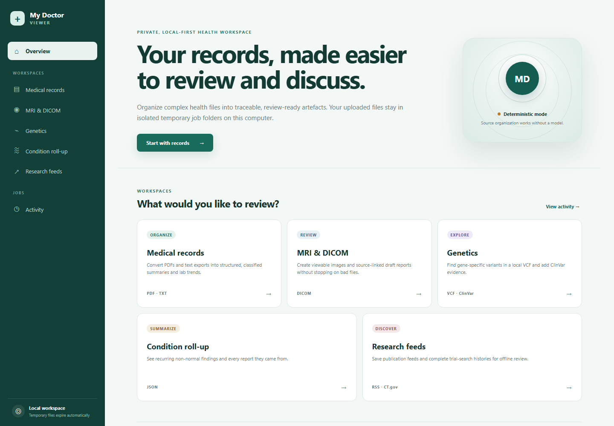
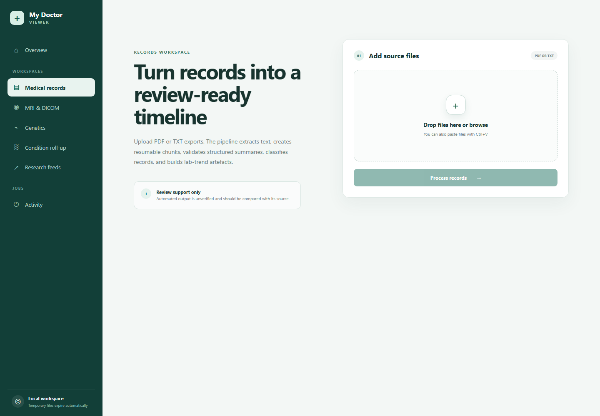
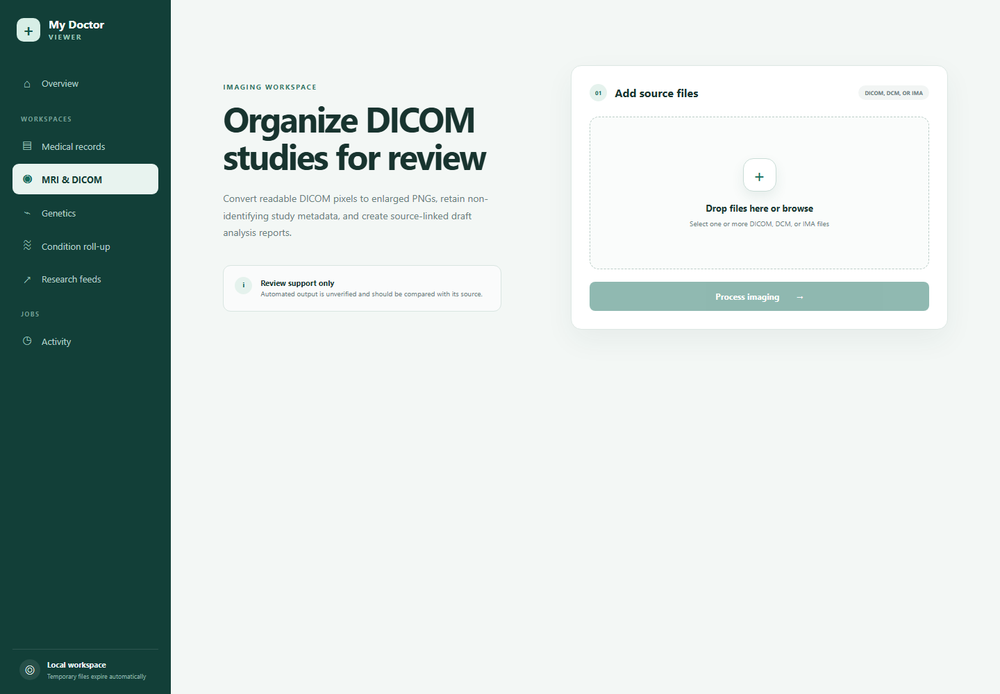
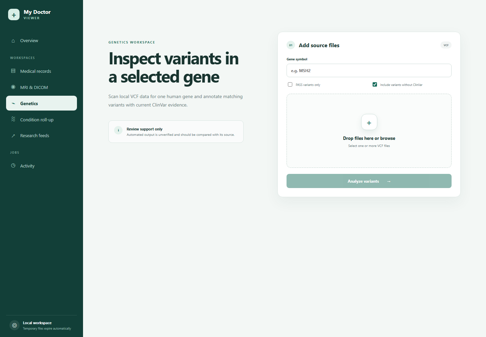
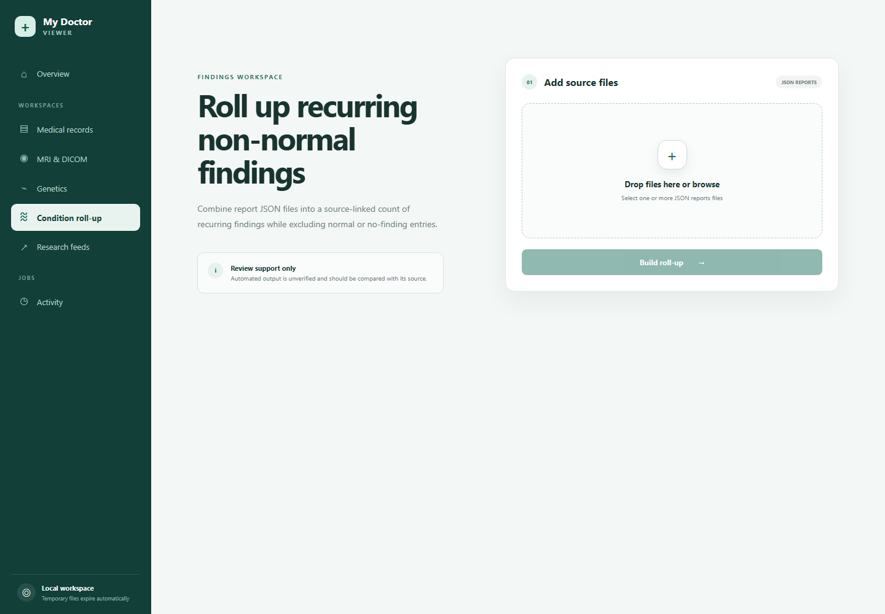
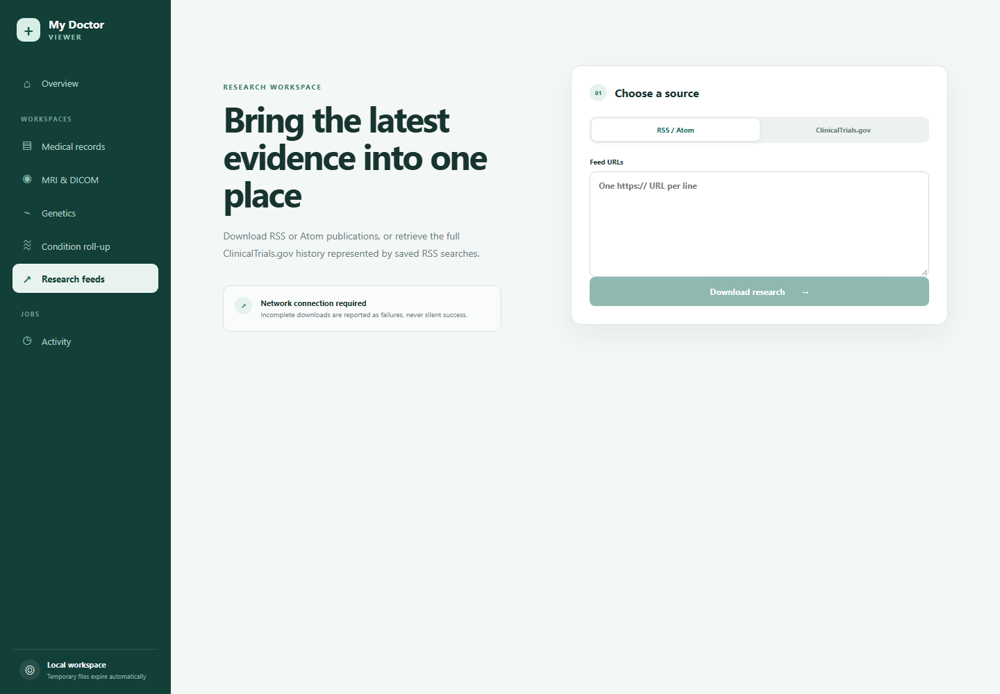
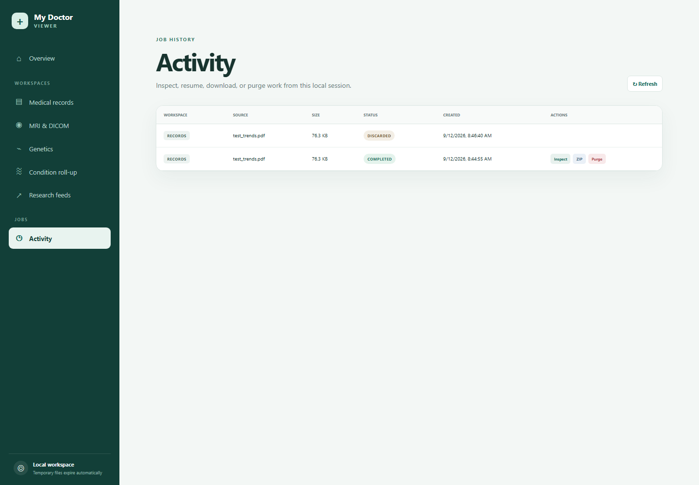

# My Doctor Viewer

A local-first React and FastAPI workspace for organizing personal medical data into traceable review artefacts. It brings the scripts in `original-project/` into a consistent job system with progress, logs, resumability, individual artefact viewing, ZIP export, and explicit source-review warnings.

> This application supports record review; it does not diagnose conditions or recommend treatment. AI-generated findings are marked unverified and linked to their uploaded source.

## Screenshots

The screenshots below were captured from the running local application at a 1440 × 1000 viewport.

| Overview | Medical records |
| --- | --- |
| [](image/01-overview.png) | [](image/02-medical-records.png) |

| MRI and DICOM | Genetics |
| --- | --- |
| [](image/03-mri-dicom.png) | [](image/04-genetics.png) |

| Condition roll-up | Research feeds |
| --- | --- |
| [](image/05-condition-rollup.png) | [](image/06-research-feeds.png) |

### Activity and job history

[](image/07-activity.png)

## Workspaces

- **Medical records** — accepts PDF and TXT files; extracts text, creates resumable chunks and a manifest, optionally summarizes with local MedGemma/Ollama, validates JSON, classifies records with evidence, surfaces uncertain classifications, and exports lab-trend CSV/PDF/PNG reports.
- **MRI & DICOM** — accepts DICOM uploads, converts readable pixel data to enlarged PNGs, records study/series metadata, creates a source-linked report for each image, logs unreadable inputs without stopping the batch, and checkpoints completed images.
- **Genetics** — accepts VCF files and a gene symbol, finds variants within the GRCh38 gene interval, and adds ClinVar evidence. NCBI access is required.
- **Condition roll-up** — accepts image/report JSON and counts recurring non-normal findings with their source files.
- **Research feeds** — downloads RSS/Atom feeds or complete ClinicalTrials.gov histories represented by saved RSS search URLs. Partial downloads fail visibly.
- **Activity** — inspects all job types, opens their logs and artefacts, resumes failed jobs from retained checkpoints, downloads ZIPs, or permanently purges temporary data.

## Quick start

Windows:

```bat
setup.bat
run.bat
```

Linux / macOS:

```bash
chmod +x setup.sh run.sh
./setup.sh
./run.sh
```

Setup creates `.venv`, installs backend and frontend dependencies, and initializes `.env`. Run starts:

- UI: <http://localhost:5173>
- API: <http://localhost:8000>
- Interactive API documentation: <http://localhost:8000/docs>

## Processing and privacy

Each job is isolated at `<system temp>/my_doctor_viewer_jobs/<uuid>/`. Uploaded sources, scratch files, outputs, logs, and the ZIP stay within that directory. The startup sweep removes folders older than `JOB_TTL_HOURS` (24 hours by default); Activity also provides an immediate Purge action.

MedGemma is optional. With `ENABLE_LLM=auto`, summaries run only when Ollama is reachable at `127.0.0.1:11434` and `OLLAMA_MODEL` is installed. Without it, record chunking/indexing and DICOM conversion still complete deterministically and report why model analysis was skipped. Genetics, RSS, and ClinicalTrials.gov workflows call the indicated public data services.

## API overview

| Endpoint | Purpose |
| --- | --- |
| `POST /api/workflows/records` | Upload PDF/TXT records |
| `POST /api/workflows/imaging` | Upload DICOM files |
| `POST /api/workflows/genetics` | Upload VCF files with gene options |
| `POST /api/workflows/conditions` | Upload report JSON files |
| `POST /api/workflows/research` | Submit RSS or ClinicalTrials.gov URLs |
| `GET /api/jobs/{id}` | Poll status, summary, and artefact list |
| `GET /api/jobs/{id}/logs` | Read processing logs |
| `POST /api/jobs/{id}/resume` | Resume a failed retained job |
| `GET /api/jobs/{id}/download-zip` | Download the completed package |
| `POST /api/jobs/{id}/discard` | Purge temporary job data |

The legacy `POST /api/convert` PDF-only endpoint remains available.

## Project layout

```text
original-project/   preserved legacy scripts
backend/            FastAPI API, workflow adapters, SQLite job registry, tests
frontend/           responsive React/Vite interface
setup.py            cross-platform setup orchestrator
setup.bat/setup.sh  setup launchers
run.bat/run.sh      development launchers
.env.example        non-sensitive configuration template
```

## Verification

```bash
# Windows
.venv\Scripts\python.exe -m pytest backend\tests -q
cd frontend && npm.cmd run build

# Linux / macOS
.venv/bin/python -m pytest backend/tests -q
cd frontend && npm run build
```
